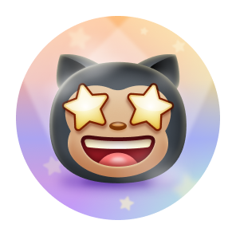
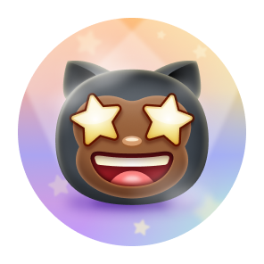
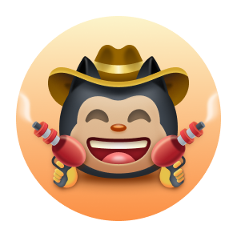
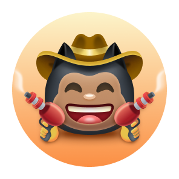
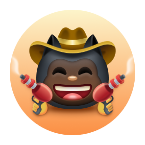

Aqui está a tradução completa do seu `README.md` para português, mantendo toda a formatação original, links e caminhos de imagens.

---

# 🏆 Guia de Conquistas e Badges do GitHub 🏆

Bem-vindo ao repositório de Conquistas do GitHub! Aqui você encontrará tudo o que precisa saber sobre as **Badges (Medalhas) do GitHub**, incluindo como ganhá-las, o que significam e muito mais. O GitHub introduziu as medalhas para celebrar diversos marcos e contribuições feitas em projetos de código aberto e na plataforma.

---

## 📈 Visão Geral das Badges do GitHub

O GitHub oferece uma variedade de medalhas para celebrar suas contribuições, engajamento e esforços de construção de comunidade. Essas medalhas podem ser exibidas no seu perfil do GitHub e estão disponíveis com base em diferentes atividades, como merge de pull requests, criação de discussões e muito mais.

### **Como Ganhar Badges do GitHub**

Para ganhar medalhas, você precisa:

* **Contribuir para Código Aberto**: Crie ou contribua com repositórios que possuam um engajamento significativo da comunidade.
* **Participar de Atividades da Comunidade**: Participe de discussões, feche issues e seja coautor de commits.
* **Demonstrar Habilidades Únicas**: Alcance marcos como realizar o merge de pull requests ou fornecer respostas úteis.

### **Tipos de Badges do GitHub**

Existem várias medalhas, cada uma representando uma conquista diferente. Elas vêm em diferentes cores e níveis, do padrão ao ouro, dependendo da frequência ou escala de sua atividade. Além disso, algumas medalhas possuem múltiplos **tons de pele** para se alinharem às preferências de tom de pele de emoji do GitHub.

---

## 🏅 Exibindo Conquistas

Você pode optar por **mostrar ou ocultar** essas conquistas em seu perfil do GitHub. Por padrão, elas ficam visíveis para qualquer pessoa que visite seu perfil público. Se preferir não exibi-las, você pode modificar essa configuração em suas [Configurações de Perfil do GitHub](https://github.com/settings).

---

## 📃 Lista de Conquistas

Abaixo está uma lista de algumas das principais **Badges do GitHub** que você pode ganhar e como obtê-las:

| Badge | Nome                 | Como Ganhar                                                            | Níveis (Padrão, Bronze, Prata, Ouro)              |
| ----- | -------------------- | ---------------------------------------------------------------------- | ------------------------------------------------- |
|       | Heart On Your Sleeve | (A definir)                                                            |                                                   |
|       | Open Sourcerer       | (A definir)                                                            |                                                   |
|       | Starstruck           | Criou um repositório com muitas estrelas                               | 16 (Bronze), 128 (Prata), 512 (Ouro)              |
|       | Quickdraw            | Fechou uma issue/pull request em menos de 5 minutos após a abertura    | 1 (Padrão)                                        |
|       | Pair Extraordinaire  | Foi coautor de um commit que sofreu merge                              | 1 (Padrão), 10 (Bronze), 24 (Prata), 48 (Ouro)    |
|       | Pull Shark           | Abriu uma pull request que sofreu merge                                | 2 (Padrão), 16 (Bronze), 128 (Prata), 1024 (Ouro) |
|       | Galaxy Brain         | Respondeu a uma discussão e teve a resposta aceita                     | 2 (Padrão), 8 (Bronze), 16 (Prata), 32 (Ouro)     |
|       | YOLO                 | Realizou o merge de uma pull request sem revisão                       | 1 (Padrão)                                        |
|       | Public Sponsor       | Patrocinou um contribuidor de código aberto através do GitHub Sponsors | 1 (Padrão)                                        |

---

## 👋 Tons de Pele das Badges

As medalhas do GitHub também podem ser personalizadas com **preferências de tom de pele** para certas conquistas. Sua preferência de tom de pele impacta como certas medalhas aparecerão em seu perfil.

Você pode definir seu **tom de pele preferido** em suas [Configurações de Aparência do GitHub](https://github.com/settings/appearance). Abaixo estão algumas medalhas que suportam versões de tons de pele:

| Badge | Nome       | Versões de Tons de Pele                                                                                                                                                                                                                                                                                                                                                                                                                                                                                                                                                                                                                                                                                                                                                                                                                                                                                                                                                                       |
| ----- | ---------- | --------------------------------------------------------------------------------------------------------------------------------------------------------------------------------------------------------------------------------------------------------------------------------------------------------------------------------------------------------------------------------------------------------------------------------------------------------------------------------------------------------------------------------------------------------------------------------------------------------------------------------------------------------------------------------------------------------------------------------------------------------------------------------------------------------------------------------------------------------------------------------------------------------------------------------------------------------------------------------------------- |
|       | Starstruck | <table> <tbody> <tr> <td align="center"></td> <td align="center"></td> <td align="center"></td> <td align="center"></td> <td align="center"></td> <td align="center"></td> </tr> <tr> <td align="center">👋</td> <td align="center">👋🏻</td> <td align="center">👋🏼</td> <td align="center">👋🏽</td> <td align="center">👋🏾</td> <td align="center">👋🏿</td> </tr> </tbody> </table> |
|       | Quickdraw  | <table> <tbody> <tr> <td align="center"></td> <td align="center"></td> <td align="center"></td> <td align="center"></td> <td align="center"></td> <td align="center"></td> </tr> <tr> <td align="center">👋</td> <td align="center">👋🏻</td> <td align="center">👋🏼</td> <td align="center">👋🏽</td> <td align="center">👋🏾</td> <td align="center">👋🏿</td> </tr> </tbody> </table>             |

---

## ✨ Medalhas de Destaque (Highlights)

Além das medalhas padrão, o GitHub oferece **medalhas de destaque** especiais para marcar a participação em certos programas exclusivos:

<table>
<tr>
<td>
<picture>
<source media="(prefers-color-scheme: dark)" srcset="[https://raw.githubusercontent.com/kavicastelo/Github-Achivements/refs/heads/main/Media/Highlights/GitHub-Pro/SVG/GitHub-Pro_LightMode.svg](https://raw.githubusercontent.com/kavicastelo/Github-Achivements/refs/heads/main/Media/Highlights/GitHub-Pro/SVG/GitHub-Pro_LightMode.svg)" />
<source media="(prefers-color-scheme: light)" srcset="[https://raw.githubusercontent.com/kavicastelo/Github-Achivements/refs/heads/main/Media/Highlights/GitHub-Pro/SVG/GitHub-Pro_DarkMode.svg](https://raw.githubusercontent.com/kavicastelo/Github-Achivements/refs/heads/main/Media/Highlights/GitHub-Pro/SVG/GitHub-Pro_DarkMode.svg)" />

</picture>
</td>
<td>GitHub Pro</td>
<td>Utilizar o GitHub Pro</td>
</tr>
<tr>
<td>
<picture>
<source media="(prefers-color-scheme: dark)" srcset="[https://raw.githubusercontent.com/kavicastelo/Github-Achivements/refs/heads/main/Media/Highlights/Developer-Program-Member/SVG/DeveloperProgramMember_LightMode.svg](https://raw.githubusercontent.com/kavicastelo/Github-Achivements/refs/heads/main/Media/Highlights/Developer-Program-Member/SVG/DeveloperProgramMember_LightMode.svg)" />
<source media="(prefers-color-scheme: light)" srcset="[https://raw.githubusercontent.com/kavicastelo/Github-Achivements/refs/heads/main/Media/Highlights/Developer-Program-Member/SVG/DeveloperProgramMember_DarkMode.svg](https://raw.githubusercontent.com/kavicastelo/Github-Achivements/refs/heads/main/Media/Highlights/Developer-Program-Member/SVG/DeveloperProgramMember_DarkMode.svg)" />

</picture>
</td>
<td>Developer Program Member</td>
<td>Registrar-se no Programa de Desenvolvedores do GitHub</td>
</tr>
<tr>
<td>
<picture>
<source media="(prefers-color-scheme: dark)" srcset="[https://raw.githubusercontent.com/kavicastelo/Github-Achivements/refs/heads/main/Media/Highlights/Security-Advisory-Credit/SVG/Security-Advisory-Credit_LightMode.svg](https://raw.githubusercontent.com/kavicastelo/Github-Achivements/refs/heads/main/Media/Highlights/Security-Advisory-Credit/SVG/Security-Advisory-Credit_LightMode.svg)" />
<source media="(prefers-color-scheme: light)" srcset="[https://raw.githubusercontent.com/kavicastelo/Github-Achivements/refs/heads/main/Media/Highlights/Security-Advisory-Credit/SVG/Security-Advisory-Credit_DarkMode.svg](https://raw.githubusercontent.com/kavicastelo/Github-Achivements/refs/heads/main/Media/Highlights/Security-Advisory-Credit/SVG/Security-Advisory-Credit_DarkMode.svg)" />

</picture>
</td>
<td>Security Advisory Credit</td>
<td>Contribuir para um aviso de segurança aceito no GitHub Advisory Database</td>
</tr>
<tr>
<td>
<picture>
<source media="(prefers-color-scheme: dark)" srcset="[https://raw.githubusercontent.com/kavicastelo/Github-Achivements/refs/heads/main/Media/Highlights/Security-Bug-Bounty-Hunter/SVG/Security-Bug-Bounty-Hunter_LightMode.svg](https://raw.githubusercontent.com/kavicastelo/Github-Achivements/refs/heads/main/Media/Highlights/Security-Bug-Bounty-Hunter/SVG/Security-Bug-Bounty-Hunter_LightMode.svg)" />
<source media="(prefers-color-scheme: light)" srcset="[https://raw.githubusercontent.com/kavicastelo/Github-Achivements/refs/heads/main/Media/Highlights/Security-Bug-Bounty-Hunter/SVG/Security-Bug-Bounty-Hunter_LightMode.svg](https://raw.githubusercontent.com/kavicastelo/Github-Achivements/refs/heads/main/Media/Highlights/Security-Bug-Bounty-Hunter/SVG/Security-Bug-Bounty-Hunter_LightMode.svg)" />

</picture>
</td>
<td>Security Bug Bounty Hunter</td>
<td>Participar do programa Security Bug Bounty do GitHub</td>
</tr>
<tr>
<td>
<picture>
<source media="(prefers-color-scheme: dark)" srcset="[https://raw.githubusercontent.com/kavicastelo/Github-Achivements/refs/heads/main/Media/Highlights/GitHub-Campus-Expert/SVG/GitHub-Campus-Expert_LightMode.svg](https://raw.githubusercontent.com/kavicastelo/Github-Achivements/refs/heads/main/Media/Highlights/GitHub-Campus-Expert/SVG/GitHub-Campus-Expert_LightMode.svg)" />
<source media="(prefers-color-scheme: light)" srcset="[https://raw.githubusercontent.com/kavicastelo/Github-Achivements/refs/heads/main/Media/Highlights/GitHub-Campus-Expert/SVG/GitHub-Campus-Expert_LightMode.svg](https://raw.githubusercontent.com/kavicastelo/Github-Achivements/refs/heads/main/Media/Highlights/GitHub-Campus-Expert/SVG/GitHub-Campus-Expert_LightMode.svg)" />

</picture>
</td>
<td>GitHub Campus Expert</td>
<td>Juntar-se ao Programa GitHub Campus</td>
</tr>
</table>

---

## ❌ Badges Indisponíveis ou Aposentadas

Algumas medalhas não estão mais disponíveis ou não podem mais ser ganhas devido à aposentadoria de programas específicos:

| Badge | Nome                          | Como Obter                                                       |
| ----- | ----------------------------- | ---------------------------------------------------------------- |
|       | Mars 2020 Contributor         | Contribuiu para o repositório da Missão do Helicóptero Mars 2020 |
|       | Arctic Code Vault Contributor | Contribuiu para o Programa de Arquivo do GitHub de 2020          |

---

## ℹ️ Mais Informações

Para mais detalhes sobre como gerenciar e personalizar seu perfil do GitHub com medalhas, confira a documentação oficial do GitHub sobre [Exibição de Medalhas](https://docs.github.com/en/account-and-profile/setting-up-and-managing-your-github-profile/customizing-your-profile/personalizing-your-profile#displaying-badges-on-your-profile).

---

## 📋 Créditos

Obrigado a [Kai](https://github.com/Schweinepriester) e [Thinkright](https://github.com/Thinkright20) pelas imagens de alta qualidade e pela grande inspiração!

## 🎉 Considerações Finais

As Conquistas do GitHub são uma maneira divertida de mostrar suas contribuições e marcos na plataforma. Ao ganhar medalhas, você pode destacar seu envolvimento na comunidade GitHub, seja através de contribuições de código, pull requests, patrocínios ou respondendo a discussões.

Bom código e continue conquistando! 🏆

---